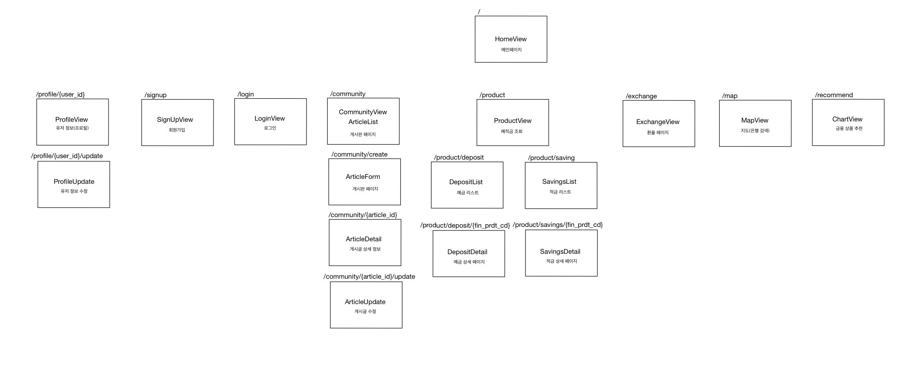
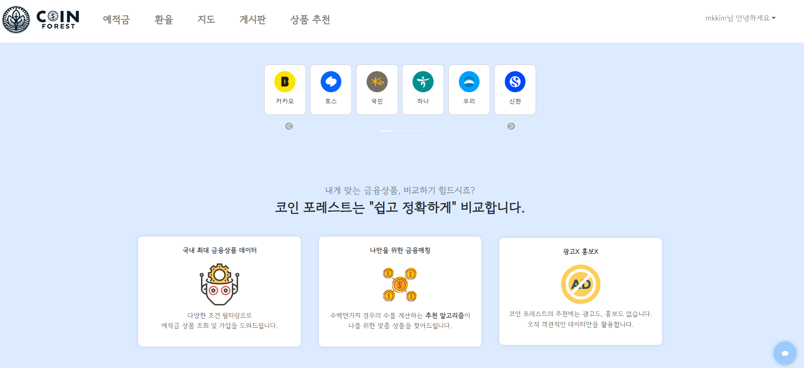
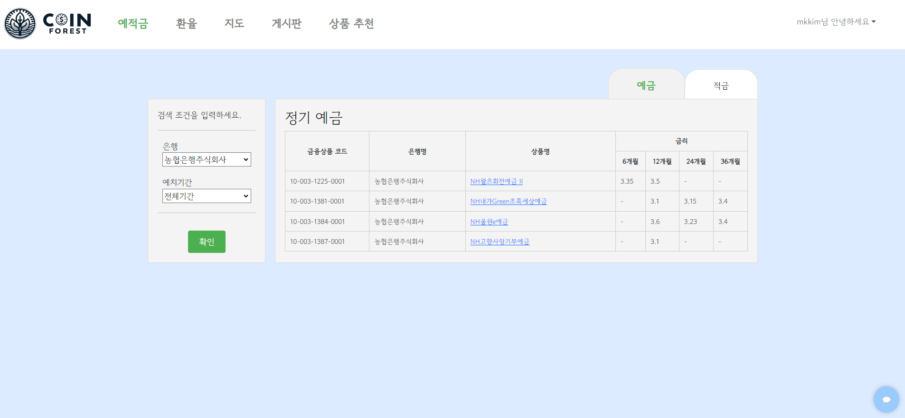
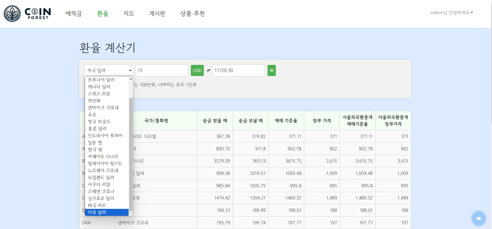
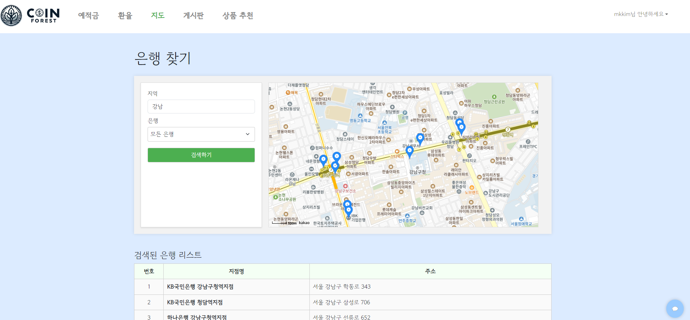
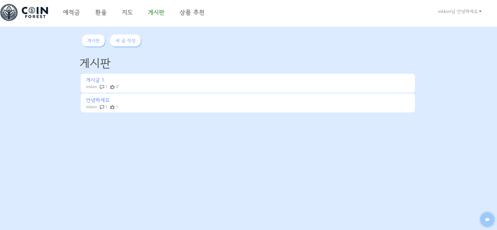
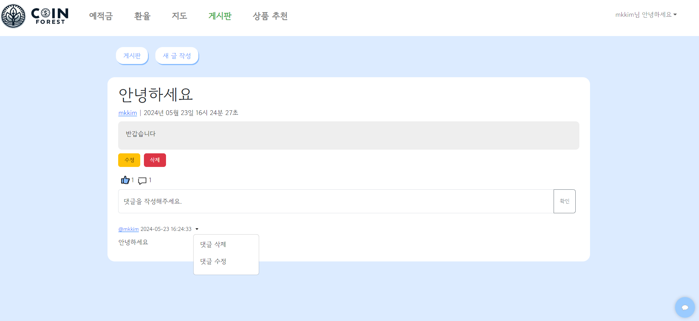
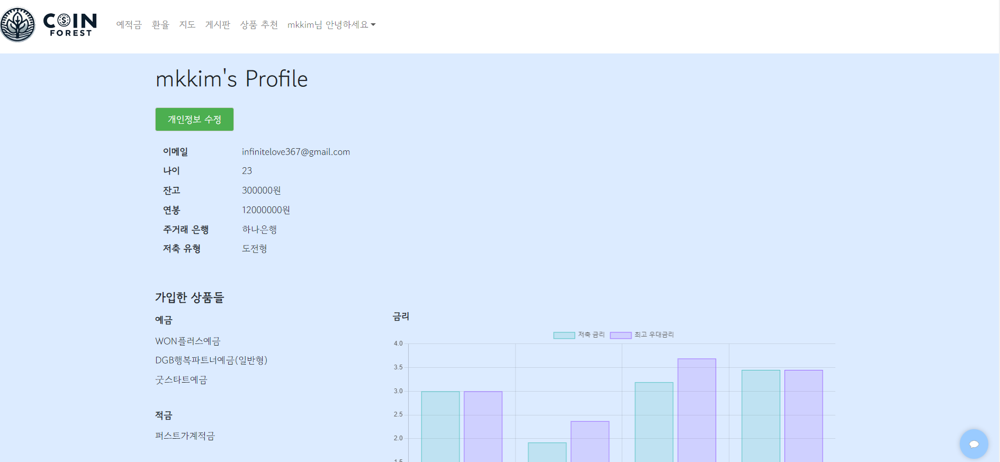
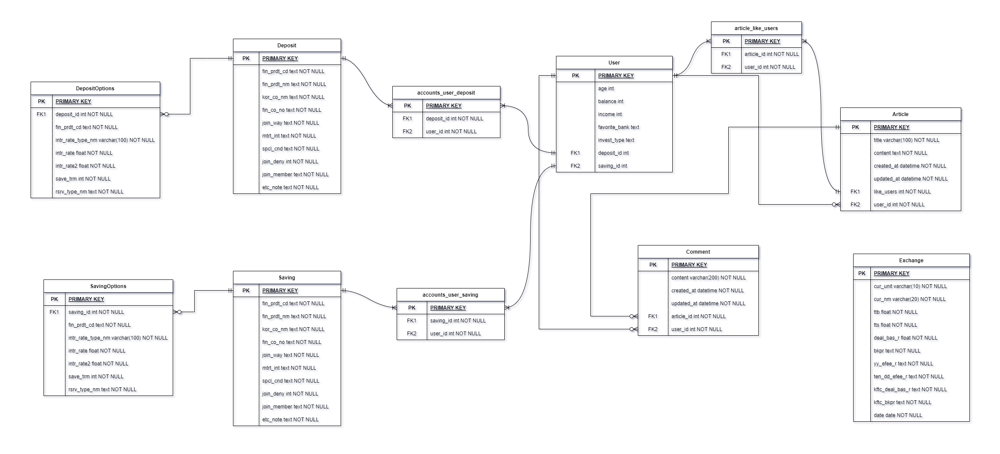
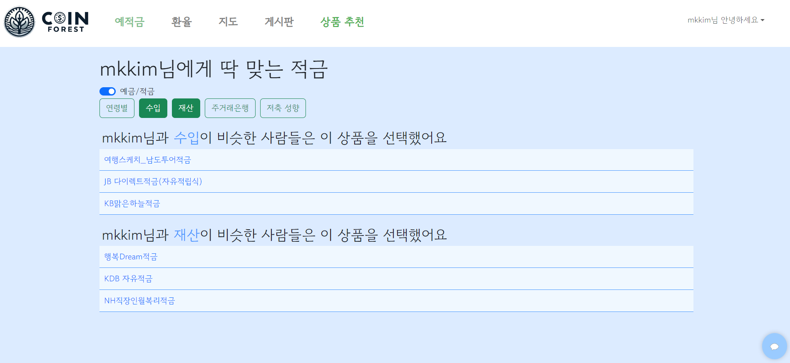

# SSAFY 11기 서울 1반 8조

- 팀명: 시속90km로선재업고튀어
- 주제: 금융

## 1. 팀원 정보 및 업무 분담 내역

### 김민경

#### 정보

- 학번: 1141410
- SSAFY 계정 메일: infinitelove37@gmail.com
- 팀장

#### 업무

- 프로젝트 기초 세팅
- 백엔드 모델 기획 및 작성
- 회원 커스터마이징
- 예적금 데이터 저장
- 예적금 상세 조회
- 커뮤니티(게시판)
- 프로필 페이지 백/프론트
- 금융 상품 추천 알고리즘 pandas로 데이터 조회 및 전반적인 업무 담당
- ERD 생성
- README 작성

### 이선재

#### 정보

- 학번: 1149344
- SSAFY 계정 메일: jamie9@naver.com

#### 업무

- 프론트엔드 구조 세팅
- 메인페이지 기획 및 스타일링
- 예적금 전체 조회 및 필터링
- 환율 계산기
- 근처 은행 검색
- 프로필 페이지 스타일링 및 가입한 상품 차트 구현
- 금융 상품 추천 알고리즘 pandas로 데이터 추출
- gpt API 이용해서 챗봇 구현
- 발표 준비 (PPT)

## 2. 설계 내용(아키텍처 등) 및 실제 구현 정도

### BACKEND architecture

#### article

- api/articles/

| IsAuthenticated | url                                           | GET                           | POST                 | PUT           | DELETE        |
| --------------- | --------------------------------------------- | ----------------------------- | -------------------- | ------------- | ------------- |
|                 | /                                             | article list 가져오기 ✅      |                      |               |               |
| ⭐              | create/                                       |                               | 게시글 생성✅        |               |               |
| ⭐              | \<int:article_pk>/                            | 단일 게시글 가져오기✅        |                      | 게시글 수정✅ | 게시글 삭제✅ |
| ⭐              | \<int:article_pk>/likes/                      |                               | 게시글에 좋아요✅    |               |               |
| ⭐              | \<int:article_pk>/comments/                   | 게시글의 댓글 목록 가져오기✅ | 게시글에 댓글 생성✅ |               |               |
| ⭐              | \<int:article_pk>/comments/\<int:comment_pk>/ |                               |                      | 댓글 수정✅   | 댓글 삭제✅   |

#### accounts

- accouts/
  | IsAuthenticated | url | GET | POST | PUT | DELETE |
  | --- | --- | --- | --- | --- | --- |
  | | login/ | | 로그인✅ | | |
  | | signup/ | | 회원가입✅ | | |
  | | \<int:user_id>/ | 유저정보 가져오기✅ | | | |
  | | \<str:username>/ | 유저정보 가져오기✅ | | | |
  | ⭐ | \<int:user_id>/update/ | | | 유저 프로필 수정✅ | |

#### banks

- api/banks/
  | IsAuthenticated | url | GET | POST | PUT | DELETE |
  | --- | --- | --- | --- | --- | --- |
  | | deposits/ | 예금 api 데이터 불러와서 front로 넘겨줌✅ | | | |
  | | deposit-options/ | 예금 옵션 모두 가져오기✅ | | | |
  | ⭐ | deposits/\<str:fin_prdt_cd>/ | 예금 상세정보✅ | | | |
  | ⭐ | deposits/\<str:fin_prdt_cd>/option/ | 예금에 맞는 옵션✅ | | | |
  | ⭐ | deposits/\<str:fin_prdt_cd>/join/ | 해당 예금 가입하기✅ | | | |
  | | savings/ | 적금 api 데이터 불러와서 front로 넘겨줌✅ | | | |
  | | saving-options/ | 적금 옵션 가져오기✅ | | | |
  | ⭐ | savings/\<str:fin_prdt_cd>/ | 적금 상세정보✅ | | | |
  | ⭐ | savings/\<str:fin_prdt_cd>/option/ | 적금에 맞는 옵션✅ | | | |
  | ⭐ | savingsexchange//\<str:fin_prdt_cd>/join/ | 해당 적금 가입하기✅ | | | |
  | ⭐ | recommend/\<int:user_id>/ | user 정보에 맞는 예/적금 상품 추천✅ | | | |
  | | exchange/ | 실시간 환율 정보 받아오기✅ | | | |
  | | local/exchange/ | DB에 저장된 가장 최근 환율 받아오기✅ | | | |
  | | banks/ | DB에 저장된 은행 이름 모두 가져오기✅ | | | |

### FRONTEND architecture



### 실제 구현 결과

1. 메인페이지
   
2. 예금 조회(필터링)
   
3. 환율 계산기
   
4. 지도 (주변 은행 찾기)
   
5. 커뮤니티

- 게시판
  
- 게시글 디테일
  

6. 프로필 (가입한 상품 금리 차트)
   
7. 상품추천 알고리즘

- 4번 항목에 첨부

## 3. 데이터베이스 모델링(ERD)



## 4. 금융 상품 추천 알고리즘에 대한 기술적 설명

- ※예시로 나이가 비슷한 user들이 많이 사용한 deposit을 가져오는 것으로 설명함

1. 현재 로그인한 user에 들어있는 개인정보(나이, 주거래은행 등)를 바탕으로 유사한 특징을 가진 유저들이 많이 가입한 순서로 3개의 상품의 이름과 상품코드를 받아옴

```py
import os
import sys
import pandas as pd
from django.db import connection
import django
from django.conf import settings

# 프로젝트 루트 디렉토리를 PYTHONPATH에 추가
project_root = os.path.dirname(os.path.dirname(os.path.abspath(__file__)))
sys.path.insert(0, project_root)

# Django settings 초기화
os.environ.setdefault('DJANGO_SETTINGS_MODULE', 'final_pjt_back.settings')
django.setup()

# 예금
# 비슷한 나이(+5살)의 사람들이 가장 많이 가입한 3개
def deposit_recommend_age(target_age):
    Query_String = f"""
    SELECT b.deposit_id FROM accounts_user a
    INNER JOIN accounts_user_deposit b ON a.id = b.user_id
    WHERE a.age BETWEEN {target_age - 5} AND {target_age + 5}
    """
    with connection.cursor() as cursor:
        cursor.execute(Query_String)
        rows = cursor.fetchall()
        columns = [col[0] for col in cursor.description]
        df = pd.DataFrame(rows, columns=columns)

    top_deposits = df['deposit_id'].value_counts().nlargest(3).index.values.tolist()
    if not top_deposits:
        return []

    deposits_str = ','.join(map(str, top_deposits))
    Query_String = f"""
    SELECT fin_prdt_cd, fin_prdt_nm FROM banks_deposit
    WHERE id IN ({deposits_str})
    """
    with connection.cursor() as cursor:
        cursor.execute(Query_String)
        rows = cursor.fetchall()
        columns = [col[0] for col in cursor.description]
        result_df = pd.DataFrame(rows, columns=columns)

    result_list = result_df.to_dict(orient='records')
    return result_list
```

2. 프론트엔드에서 데이터를 요청할 백엔드 view 함수에서 받은 유저 정보를 함수 인자로 넣어 1번 함수로 보냄 그 후 받은 정보를 프론트엔드로 보내줌
   - 혹시 특정 정보를 입력하지 않은 사람이 있으면 `None` 값을 보냄

```py
@api_view(['GET'])
@permission_classes([IsAuthenticated])
def recommend(request, user_id):
    user = User.objects.get(pk=user_id)
    if request.method == 'GET':
        user_serializer = CustomUserSerializer(user)
        age, favorite_bank, balance, income, type = user_serializer.data['age'], user_serializer.data['favorite_bank'], user_serializer.data['balance'], user_serializer.data['income'], user_serializer.data['invest_type']

        context = {
            'deposit': {
                'age': deposit_recommend_age(age) if age != None else None,
                'favorite_bank': deposit_recommend_bank(favorite_bank) if favorite_bank != None else None,
                'balance': deposit_recommend_balance(balance) if balance != None else None,
                'income': deposit_recommend_income(income) if income != None else None,
                'invest_type': deposit_recommend_type(type) if type != None else None
            },
            'saving' :{
                'age': saving_recommend_age(age) if age != None else None,
                'favorite_bank': saving_recommend_bank(favorite_bank) if favorite_bank != None else None,
                'balance': saving_recommend_balance(balance) if balance != None else None,
                'income': saving_recommend_income(income) if income != None else None,
                'invest_type': saving_recommend_type(type) if type != None else None
                },
            }

    return Response(context)
```

3. axios로 요청한 데이터를 받아 화면에 출력
   - 사용자가 원하는 검색어만 출력하도록 구성

```js
const deposits_age = ref(null);
const deposits_balance = ref(null);
const deposits_bank = ref(null);
const deposits_income = ref(null);
const deposits_type = ref(null);

onMounted(() => {
  axios({
    method: "get",
    url: `${API_URL}/api/banks/recommend/${authStore.info.id}/`,
    headers: {
      Authorization: `Token ${authStore.token}`,
    },
  })
    .then((res) => {
      deposits_age.value = res.data.deposit["age"];
      deposits_balance.value = res.data.deposit["balance"];
      deposits_bank.value = res.data.deposit["favorite_bank"];
      deposits_income.value = res.data.deposit["income"];
      deposits_type.value = res.data.deposit["invest_type"];
    })
    .catch((err) => {
      console.log(err);
      alert("로그인 해주세요.");
      router.replace({ name: "LogInView" });
    });
});
```

- 결과
  

## 5. 서비스 대표 기능들에 대한 설명

1. 예적금 상품 조회

- 기본적으로 필터링 적용을 안한 모든 예금 리스트가 나온다.
- 원하는 은행과 기간을 선택하면 그에 따른 상품들만 화면에 출력된다.

2. 환율 계산기

- API에 접속 가능한 시간에는 실시간 환율을 받아와 그에 따른 반환값과 각종 정보를 출력한다.
- API 접속 불가능한 시간에는 DB에 저장되어있는 가장 최근 환율을 불러와 계산해준다.

3. 근처 은행 찾기

- 카카오맵 API를 사용하여 원하는 지역을 검색하면 주변 모든 은행을 찾아준다.
- 은행 리스트와 지도를 생성해서 원하는 지역을 보여준다.

4. 커뮤니티 게시판

- 기본적인 기능이라 스타일과 편의성에 집중함.
- 게시판 리스트는 모두가 볼 수 있지만 상세페이지는 로그인한 사용자만 접근 가능
- 좋아요와 댓글 기능은 vanilla js를 이용하여 실시간으로 댓글과 좋아요가 반영되는 것처럼 만들어보았다.

5. 상품 추천 알고리즘

- 4번 항목에서 기술적 측면을 설명함
- bootstrap을 이용하여 깔끔한 디자인을 완성했고 사용자 친화적인 반응형 페이지로 제작함

6. 프로필

- 사용자의 정보 출력
- ManytoMany 관계로 연결되어있는 예/적금 모델을 이용하여 해당 사용자가 어떤 상품에 가입되어있는지 알 수 있음
- 가입한 상품들의 저축금리/최고 우대금리를 chart.js를 이용하여 프로필에 출력

7. 챗봇

- gpt API를 이용해 화면 하단에 챗봇 구현

## 6. 기타

### 이선재

#### 느낀 점

- 완벽한 페어와 협업하며 모의 금융 플랫폼 개발할 수 있었던 프로젝트!

#### 후기

- 원활한 소통과 상호 보완을 통해 효율적으로 작업을 진행할 수 있었고,
  다양한 기술을 적용하며 협업의 중요성을 다시 한번 깨닫게 된 의미 있는 시간이었다.

### 김민경

#### 느낀 점

- 팀원이 너무 좋아서 하나도 힘들지 않았습니다
- 벌써 1학기가 끝났다니 아쉬워요

#### 후기

- 처음 해보는 팀 프로젝트였는데 팀원과 서로 모자란 부분을 잘 채워준 것 같고 역할 분담도 자연스럽게 잘 되어 협업을 잘 할 수 있었다. 협업 능력을 기를 수 있는 프로젝트였다.
- 일주일 동안 하는 짧은 프로젝트 기간동안 요구사항을 모두 끝낼 수 있을지 막막했지만 결국 해내는 우리팀을 보며 자신감을 얻었다.
